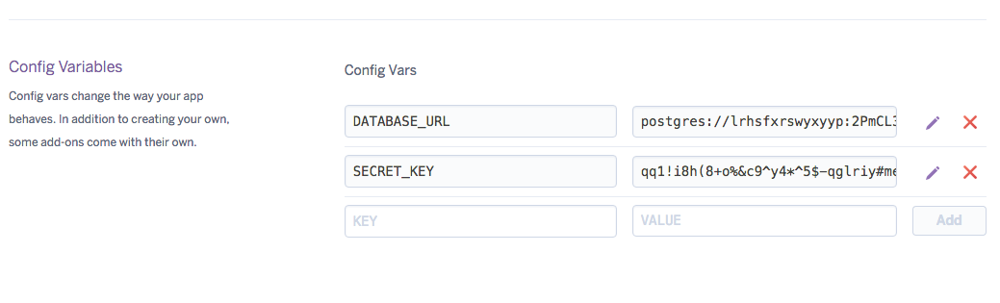

# <small>Push your </small>Django Apps <small>to</small> Heroku
Mohsin Mahmood edited this page on May 22, 2019


**Heroku** is a cloud application platform, it is a **PaaS (Platform-as-a-service)** service. It allows you to deploy your web application from your localhost to cloud so that your application could be commercialized and could get production ready.


## 1. Preparing your application
***

Copy the Project folder separately for deployment.

## 2. Initialize Git Repositor
***

- Install [Git](https://git-scm.com/)
- Press <kbd>WIN</kbd>+<kbd>R</kbd>
- Type `cmd` and click OK
- Navigate to project folder
- Make sure your are in the directory where the `manage.py` exists
    
```commandline
git config --global user.name "Your Name"
git config --global user.email "you@youraddress.com"    
git config --global user.email "you@youraddress.com"
git init
``` 

## 3. Add Files To Git
***

```commandline
git add --all
git commit -m "Commit Message"
git push
```


## 4. Activate Virtual Environment
***

Activating virtual environment.

```text
manage.py         # The configuration file.
venv/
    Scripts/       
    	activate
```  

Run these command to activate the environment.
     
```text
cd venv/Scripts/
activate
```
If virtual environment not already exists.
Run these commands on command prompt. 

```commandline
pip install virtualenv
```

- Install all the required libraries that your project required via `pip`  command.
- Plus install the following dependencies in your virtual environment.

```commandline
pip install gunicorn
pip install django-heroku
pip install python-decouple
``` 

> django-heroku: official package by Heroku which made our deployment simple.


## 5 Modify `Setting.py` file
***

Now, In app/settings.py file add below content

```python
#import os
import django_heroku
from decouple import config
import dj_database_url
```

At the **end** of the `setting.py` file add this line also.

```python
django_heroku.settings(locals())
```

Now we need to hide the `SECRET_KEY` from the deployment code.
For this, add this line of code before  
`SECRET_KEY  = "Djfhslkdfsjf*(skdf0suerjwehksjdf"`

```python
SECRET_KEY = config('SECRET_KEY')
```

Move your actual `SECRET_KEY` to the `.env` file that we are going to create.


## 6. Create a file `.env`
***

Now, run a command in your terminal.It will create a file `.env` in your app directory.  

```commandline
touch .env
```

> Add your `SECRET_KEY` from setting.py to `.env` file.

## 7. Adding more to `setting.py`
***

Do this in your **app/settings.py**.

```python
STATICFILES_DIRS = [
    os.path.join(BASE_DIR, "static")

]
```

Make sure you do not have this command in setting.py file already. If so remain it as it is.</br>
<a href="https://docs.djangoproject.com/en/2.1/howto/static-files/" target="_blank">For more info</a>


```python
STATIC_ROOT = os.path.join(BASE_DIR, 'staticfiles')
```


## 8. Static file serving for web apps
***

To serve static assets I use the WhiteNoise project. To install: `pip install whitenoise`
<a href="http://whitenoise.evans.io/en/stable/" target="_blank">For more info </a>

Do this in your **app/settings.py** file.

```python
#...    
#'django.middleware.security.SecurityMiddleware',
'whitenoise.middleware.WhiteNoiseMiddleware',
#'django.contrib.sessions.middleware.SessionMiddleware',
#'django.middleware.common.CommonMiddleware',
#...
```

```python
STATICFILES_STORAGE = 'whitenoise.storage.CompressedManifestStaticFilesStorage'
```

## 9. Create a Procfile
***

Open the command prompt in your directory and type this command.
> Make sure you type `Procfile` correctly (casesensitve)


```commandline
touch Procfile
```

Open the Procfile and add this line in the file.

```text
web: gunicorn <project name>.wsgi
```

## 10. Run Django Server
*** 

Type this command in the command promt to open the django server.


```commandline
python manage.py runserver
```

run this command too.


```commandline
python manage.py migrate
```

If your site is working correctly then move to next step.

## 11. Creating a file `requirements.txt`
***

This command create a file requiremets.txt and add all the dependencies that your application needed while pushing to heroku.

```commandline
pip freeze > requirements.txt
```

add dependency `requests==2.21.0` to the requirements.txt file. 

## 12. Heroku Sign up
***

Start a 
<a href="https://signup.heroku.com/" target="_blank">heroku</a>
account — Sign up.

Install 
<a href="https://devcenter.heroku.com/articles/heroku-cli" target="_blank">Heroku</a>
Toolbelt commands

After installing heroku toolbelt your terminal will support all the heroku commands.Open your terminal as administrator and run this code

```commandline
heroku login
```

login to your heroku account via terminal
>Enter your Heroku credentials.

```commandline

Email: example@gmail.com
Password (typing will be hidden):
Authentication successful.

```

Inside the project root, create a Heroku App:

```commandline
heroku create
```

Adding a Heroku app to Git remote

```commandline
heroku git:remote -a <APPNAME>
```

Open the heroku [dashboard](https://dashboard.heroku.com/login) and navigate to your new created app.

In setting tab, add the config vars: `SECRET_KEY`



## 13. Update Git repository
***

```commandline
git add --all
git status    # to view all the changes
git commit -m "ready to push"
```
## 14. Finally Push to Heroku
***


```commandline
git push heroku master
```


